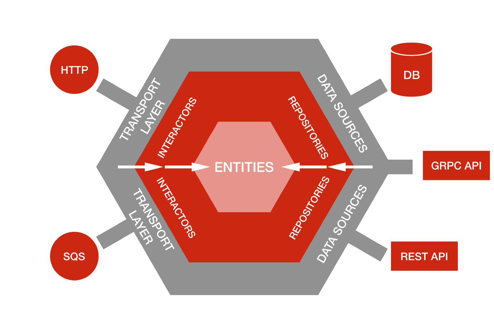
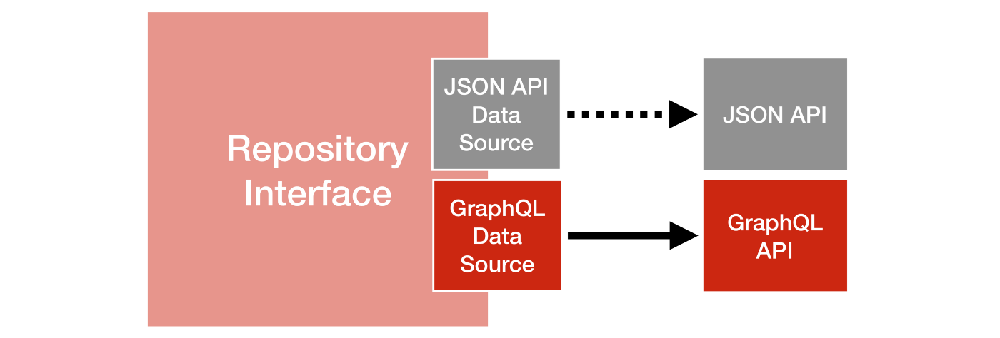
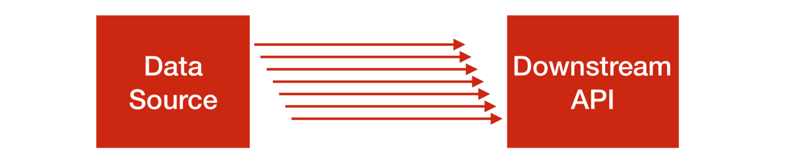
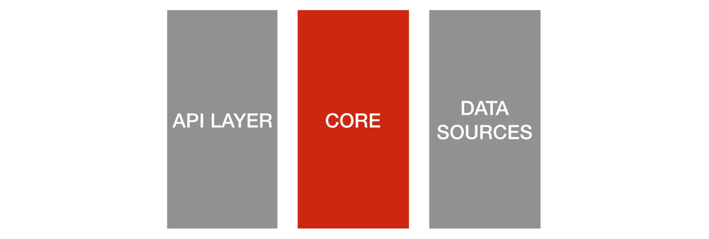
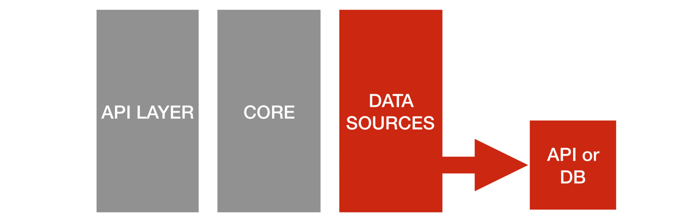
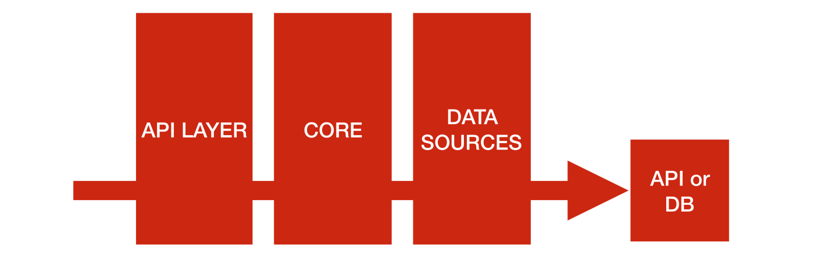

# 헥사고날 아키텍처로 변경사항에 대해 준비하기

## 원문 및 저자

- [Ready for changes with Hexagonal Architecture](https://netflixtechblog.com/ready-for-changes-with-hexagonal-architecture-b315ec967749)
- [Damir Svrtan](https://twitter.com/DamirSvrtan)
- [Sergii Makagon](https://twitter.com/makagon)

## 본문

Netflix Originals 의 제작이 매년 증가함에 따라 우리는 전체적인 창작 과정에서 효율성을 가능하게 하는 앱을 빌드할 필요성이 커지고 있습니다.
우리의 큰 스튜디오 엔지니어링 조직(Studio Engineering Organization)은 각본 획득, 거래 협상 및 공급업체 관리에서 스케줄링 스트리밍 생산 워크플로우 등등, 각본에서 재생에 이르르기까지 컨텐츠의 프로그래스(각본 계약 -> 각본 -> 컨텐츠 제작 -> 넷플릭스 업로드 -> 유저 재생)를 돕기 위한 많은 앱을 만들어 왔습니다.

### 고도로 통합된 것으로부터의 시작

약 1년 전, 우리의 스튜디오 워크플로우(Studio Workflow) 팀은 비즈니스의 여러 영역을 가로지르는 새로운 앱에 대한 작업을 시작하였습니다.
우리는 우리 손으로 도전하는 것에 대하여 흥미를 가지고 있었습니다. 우리는 처음부터 앱의 핵심부터 구축 해야했지만, 많은 다른 시스템에 존재하는 데이터도 필요하였습니다.

우리가 필요로하는 영화에 대한 데이터, 생산 일자, 종업원, 촬영 장소와 같은 몇몇 데이터들은 다양한 프로토콜(gRPC, JSON API, GraphQL)로 구현된 많은 서비스에 걸쳐 분산되어 있었습니다.
기존의 데이터는 우리의 동작과 비즈니스 로직에서 굉장히 중요했습니다.
우리는 시작부터 고도로 통합되어야 했습니다.

### 교체 가능한 데이터 소스

우리의 프로덕션으로 가져올 수 있는 것으로 보이는 하나의 초기 어플리케이션은 모놀리스로 구축되어 있었습니다.
모놀리스는 어플리케이션에 대한 지식이 없는 상태에서 신속한 개발과 빠른 변화를 가능하게 했습니다.
한 때, 그 어플리케이션을 위해 30명이 넘는 개발자가 일을 하였고, 300개 이상의 데이터베이스 테이블을 가지고 있었습니다.

시간이 지나면서 어플리케이션은 광범위한 서비스를 제공하는 것에서 고도로 특화된 서비스로 진화하였습니다.
이것은 결과적으로 모놀리스를 특정 서비스로 분리하는 결정으로 이어졌습니다.
이 결정은 성능 이슈가 아니라 서로 다른 도메인들에 대하여 경계를 설정하고 전담 팀이 도메인에 특화된 서비스를 독립적으로 개발할 수 있도록 하는 것이었습니다.

우리가 새로운 앱을 위해 필요로 하는 많은 데이터는 여전히 모놀리스에 의해 제공되고 있지만, 우리는 모놀리스가 언젠가는 깨질 것이라는 것을 알고 있었습니다.
우리는 언제 깨질 것인지에 대한 타이밍은 확신할 수 없지만, 우리는 깨지는 것이 불가피하고, 준비해야 한다는 것을 알고 있었습니다.

그러므로, 처음에는 모놀리스가 여전히 근원 데이터였기 때문에 일부 데이터를 활용할 수 있었습니다. 그러나 온라인이 되자마자 이러한 데이터 소스를 새로운 마이크로서비스로 교체할 준비가 되어있었습니다.

### 헥사고날 아키텍쳐 활용하기

우리는 비즈니스 로직에 영향을 주지 않고 데이터 소스를 교체할 수 있는 기능을 지원해야 했습니다. 그래서 비즈니스 로직과 데이터 소스를 분리할 필요가 있다는 것을 알았습니다.
앱을 구축하는데 있어 [헥사고날 아키텍처](https://en.wikipedia.org/wiki/Hexagonal_architecture_(software))에 기반을 두기로 결정하였습니다.

헥사고날 아키텍처의 기본적인 생각은 설계의 가장자리에 입력과 출력을 두는 것입니다.
비즈니스 로직은 REST 나 GraphQL API 노출되어 있는지 아닌지에 의존하지 않습니다. 그리고 비즈니스 로직은 어디서 데이터를 가져올지(데이터베이스, gRPC 나 REST 로 노출된 마이크로서비스의 API, 단순한 CSV 파일 등)에 대하여도 의존하지 않습니다.

이 패턴을 사용하여 외부의 관심과 어플리케이션의 핵심 로직을 분리할 수 있습니다.
핵심 로직을 분리한다는 것은 **코드 베이스에 큰 영향을 주거나 주요 코드를 새로 작성하지 않고** 데이터 소스에 대한 세부사항을 쉽게 변경할 수 있도록 해준다는 것을 의미합니다.

앱에서 명확한 경계를 가지는 것을 통해 얻을 수 있는 주요한 이점 중 하나는 테스트 전략입니다. 주요한 테스트들은 **쉽게 변할 수 있는 프로토콜에 의존하지 않고** 비즈니스 로직을 검증할 수 있습니다.

### 핵심 개념 정의
핵사고날 아키텍쳐 활용에 있어 비즈니스 로직을 정의하는 세가지 핵심 개념이 있습니다. - 엔티티(Entity), 레포지토리(Repository), 인디케이터(Indicator)

* **엔티티**는 도메인 객체입니다. (e.g. 영화 혹은 촬영장소) - Ruby on Rails 나 JPA 에 있는 Active Record 와 다르게 이것들은 어디에 저장되는지 모릅니다.
* **레포지토리**는 엔티티를 가져오는 것 뿐만 아니라 엔티티를 생성하고 변경하기 위한 인터페이스 입니다. 레포지토리는 데이터 소스와 통신하고 하나 혹은 여러개의 엔티티를 반환하기 위한 메서드들을 가지고 있습니다.
* **인디케이터**는 도메인의 행위를 조직(orchestrate)하고 수행하기 위한 클래스입니다. Service Object 나 Use Case Object 들을 생각하시면 됩니다. 인디케이터들은 복잡한 비즈니스 규칙과 특정 도메인의 행위를 위한 유효성 검증 로직을 구현합니다. (e.g. 프로덕션 온보딩)

이 세 가지의 유형의 주요 object를 이용하여 데이터가 어디에 유지되고 어떻게 비즈니스 로직이 트리거 되는지에 대한 어떤 지식이나 관심 없이 비즈니스 로직을 정의할 수 있습니다.
비즈니스 로직의 외부에는 데이터 소스와 트랜스포트 레이어(Transport Layer, 전송계층)가 있습니다.

* **데이터 소스**는 서로 다른 저장소를 구현한 어댑터입니다. 데이터 소스는 SQL 데이터베이스(Rails 나 JPA 의 Active Record 클래스)에 대한 어댑터일 수도 있고, 엘라스틱 서치의 어뎁터, REST API 혹은 심지어 CSV 파일이나 해시같은 단순한 어떤 것의 어댑터일 수도 있습니다. 데이터 소스 구현 메서드는 레포지토리에 정의된 메서드를 구현하고 데이터를 가져(fetch)오거나 삽입(push)하는 구현을 가지고 있습니다.

* **트랜스포트 레이어**는 비즈니스 로직을 수행하기 위한 인디케이터를 시작할 수 있습니다. 이것을 우리 시스템의 입력으로 다룹니다. 대부분 마이크로서비스를 위한 공통적인 트랜스포트 레이어는 HTTP API 레이어와 요청을 처리하는 컨트롤러의 집합입니다. 비즈니스 로직을 인터렉터(interactor)로 추출함으로써 특정한 트랜스포트 레이어나 컨트롤러의 구현에 의존하지 않습니다. 인디케이터는 컨트롤러 뿐만 아니라 이벤트나 크론잡(cron job), 커맨드 라인으로 시작될 수 있습니다.

    
    
헥사고날 아키텍처에서 의존성 그래프는 내부를 향합니다.

전통적인 레이어드 아키텍처는 각각의 위의 레이어가 아래에 있는 레이어를 의존하는 방식으로 한 방향으로 모든 의존성을 가지고 있습니다.
트랜스포트 레이어는 인디케이터에 의존하고 인디케이터는 퍼시스턴스 레이어를 의존합니다.

헥사고날 아키텍쳐에서 모든 의존성은 내부를 가리키고 있습니다 - 핵심 비즈니스 로직은 트랜스포트 레이어나 데이터소스에 대하여 아무것도 모릅니다.
여전히 트랜스포트 레이어는 어떻게 인디케이터를 사용하는지, 데이터 소스는 저장소 인터페이스를 어떻게 따르고 있는지(conform) 알고 있습니다.

이것을 통해 다른 스튜디오 시스템들의 불가피한 변화에 대비하고, 필요할 때 쉽게 데이터 소스를 변경할 수 있습니다.

### 데이터 소스 변경

데이터 소스의 변경은 우리가 예상했던 것보다 일찍 다가왔습니다. - 갑작스럽게 모놀리스의 읽기 한도에 도달하였고, 하나의 엔티티에 대한 읽기 작업의 일부를 GraphQL 집계 레이어로 열린(exposed) 새로운 마이크로서비스로 전환해야 했습니다.
마이크로서비스와 모놀리스 모두 동기화 되어 동일한 데이터를 가지고 있었고 하나의 서비스에서 읽으나 다른 것에서 읽으나 동일한 결과를 얻을 수 있었습니다.

**우리는 2시간만에 JSON API에서 GraphQL 데이터 소스로 읽기 요청을 전송할 수 있었습니다.**

빠르게 이 작업을 할 수 있었던 주요한 이유는 헥사고날 아키텍처 때문입니다.
우리는 어떤 퍼시스턴스에 대한 세부사항도 우리의 비즈니스 로직으로 노출하지 않았습니다.
우리는 레포지토리 인터페이스를 구현하는 GraphQL 데이터 소스를 생성하였습니다.
**단순하게 한 줄을 변경시키는 것**이 우리가 다른 데이터 소스로부터 데이터를 읽어오기 시작하는데 필요한 것이었습니다.

    
    
적절한 추상화는 데이터 소스 변경을 쉽게 해줍니다.

이 순간, 헥사고날 아키텍처가 우리에게 적절했다는 것을 알게 되었습니다.

한 줄을 변경시키는 것의 중요한 점은 릴리즈의 위험을 완화시켜줍니다.
이것은 다운스트림 마이크로서비스(downstream microservice, 특정 서비스을 호출하는 서비스, A가 B를 호출할 때, B가 upstream 이고, A가 downstream 이다.)가 초기 배포에서 실패한 경우 롤백하기가 매우 쉽습니다.
또한 구성(Configuration)을 통해 어떤 데이터 소스를 사용할 지 결정할 수 있는 것처럼, 배포와 활성화의 결합도를 낮춰줄 수 있습니다.

### 데이터 소스 세부사항을 숨기기

이 아키텍처의 굉장한 이점은 데이터 소스 구현 세부사항을 캡슐화할 수 있다는 것 입니다.
우리는 api 콜이 필요한데, 아직 존재하지 않는 경우로 들어가 봅시다. - 서비스는 하나의 자원을 가져오기(fetch) 위한 API 를 하나 가지고 있지만 아직 대량으로 가져오기(bulk fetch) 위한 API 는 구현되지 않았다고 해봅시다.
API를 제공하는 팀과 이야기한 후, 이 엔드포인트가 전달되기 까지 시간이 걸린다는 것을 알게 되었습니다.
그래서 엔드포인트가 만들어지는 동안 문제를 해결하기 위해 다른 해결방안으로 작업을 먼저 진행하기로 결정하였습니다.

여러 개의 레코드 식별자를 주고 여러 개의 리소스를 가져오는 레포지토리 메서드를 정의했습니다. 그리고 데이터 소스에 대한 메서드 구현의 첫번째 단계로 다운스트림 서비스에 대하여 복수의 동시 요청을 전송하도록 구현하였습니다.
우리는 이것이 일시적인 해결방안이고 데이터 소스 구현의 두번째 단계에서 구현된 bulk API 를 사용하는 것을 알고 있습니다.

    
    
비즈니스 로직은 데이터 소스 제약사항에 대하여 알 필요가 없습니다.

이와 같은 설계는 많은 기술 부채나 이후에 비즈니스 로직에 대한 변화에 대한 필요성없이 비즈니스 요구사항을 충족시키기 위해 나아가는 것을 가능하게 해준다.

### 테스트 전략

헥사고날 아키텍처로 실험하기 시작했을 때, 우리는 테스트 전략을 세워야 한다는 것을 알고 있었습니다.
빠른 개발 속도를 위한 전제 조건은 신뢰할 수 있고 완전 빠른 테스트들을 가지고 있는 것 입니다.
**가지는 것이 좋겠다라고 생각한 것이 아니라 반드시 가져야 한다고 생각합니다.**

우리 앱의 세 개의 다른 레이어를 테스트하기로 결정하였습니다.

* **인디케이터**를 테스트합니다. 여기에는 핵심 비즈니스 로직이 있습니다 하지만 어떤 퍼시스턴스나 전송에 대해서도 독립적입니다. 모든 리포지토리와의 상호 작용에서 의존성 주입과 목을 활용하기로 하였습니다. 여기에서 비즈니스 로직을 상세하게 테스트하고, 여기에서 테스트를 가장 많이 하려고 노력합니다.

    

* 다른 서비스들과 잘 통합되었는지, 레포지토리 인터페이스를 잘 따르고 있는지 그리고 오류 발생시 어떻게 동작하는지 확인하기 위하여 **데이터 소스**를 테스트합니다. 우리는 이러한 테스트의 양을 최소화하려고 합니다.

    

* 전송/API 레이어부터 인디케이터, 레포지토리, 데이터소스와 다운스트림 서비스에 도달하는 것까지 전체 스택을 관통하는 **통합 테스트**(integration specs, 의역)가 있습니다. 이 테스트는 모든 것이 잘 "연결"했는지 테스트합니다. 만일 데이터 소스가 외부 API 라면, 그 엔트포인트에 도달하고 응답을 기록하고(그리고 그것들을 git 에 저장), 테스트 집합(test suite)이 모든 후속 호출에서 빠르게 실행할 수 있도록 합니다. 우리는 해당 레이어에서 테스트 커버리지를 넓게 하지 않습니다. - 하나의 도메인 액션에 대하여 보통 하나의 성공 시나리오와 하나의 실패 시나리오만 작성합니다.

    

레포지토리는 데이터 소스가 구현하는 단순한 인터페이스이기 때문에 테스트하지 않고, 엔티티는 속성(attribute)이 정의된 단순한(plain) object이기 때문에 테스트를 거의 하지 않습니다.
엔티티가 퍼시스턴스 레이어를 건드리지 않는 추가적인 메서드가 있는 경우 테스트합니다.

100% [계약 테스트](https://docs.pact.io/#what-is-contract-testing)(contract test)에 의존하고 어떤 서비스도 ping 하지 않는 등의 개선의 여지가 있습니다.
테스트 집합을 위의 방법으로 작성하면 3000개의 테스트를 하나의 프로세스에서 100초 내로 실행할 수 있습니다.

어떤 머신에서든 쉽게 실행할 수 있는 테스트 집합과 함께 일을 하는 것은 사랑스럽고 우리 개발 팀은 중단 없이 일상적인 기능에 대하여 작업할 수 있습니다.

### 결정 늦추기

우리는 데이터 소스를 다른 마이크로서비스로 전환할 때 매우 좋은 전략을 취하고 있습니다.
하나의 핵심적인 이점은 어떻게 데이터를 우리 어플리케이션 내부에 저장할지 혹은 저장할지 안할지에 대한 몇 가지 결정을 늦출 수 있습니다.
피쳐의 유스케이스에 기반하여, 데이터 저장소의 유형(관계형 혹은 문서형)을 결정하는데 있어 유연해질 수 있습니다.

프로젝트를 시작하는 시점에 우리는 우리가 만드려는 시스템에 대한 최소한의 정보만 가지고 있습니다.
우리를 [프로잭트 패러독스](https://twitter.com/tofo/status/512666251055742977)(지식이나 알려진 것이 없는데 큰 결정을 내리는 것)로 이끄는, 지식이 없는 상태에서 결정을 내려 스스로를 아키텍쳐 안에 가두면 안됩니다.

우리가 내린 결정은 지금 우리의 필요에 적합하고 빠르게 움직일 수 있게 해주었습니다.
헥사고날 아키텍처의 가장 좋은 점은 미래의 요구사항에 대하여 유연하게 어플리케이션을 유지할 수 있다는 것입니다.

